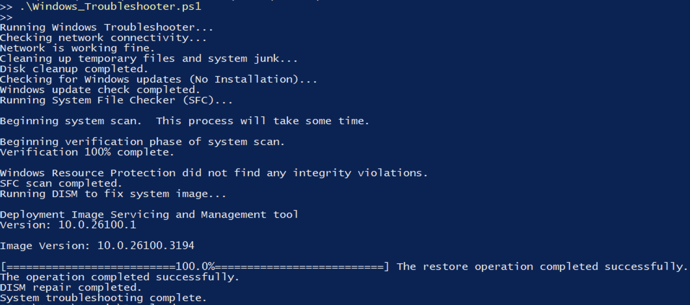

# Windows Troubleshooter

## Overview
This PowerShell script automates the process of diagnosing and fixing common Windows issues, including:
- Checking and fixing network connectivity problems
- Cleaning up temporary files and system junk
- Checking for Windows updates (without auto-installation)
- Running System File Checker (SFC) and DISM to repair system files

## Features
- Automated Troubleshooting: Detects and resolves common Windows issues.
- Admin Privileges Check: Automatically requests elevated privileges if required.
- Modular Execution: Run specific troubleshooting functions individually.

## Usage
### Clone the Repository
```powershell
git clone https://github.com/your-username/Troubleshooting-Scripts.git
cd Troubleshooting-Scripts/Project-1_Windows-Troubleshooter
```
### Run the Script in PowerShell (Admin)
```powershell
.\Windows_Troubleshooter.ps1
```
### Run Specific Troubleshooting Functions
```powershell
Check-Network
Clean-Disk
Check-WindowsUpdates
Repair-SystemFiles
```

## Prerequisites
- Windows PowerShell v5.1 or later
- Administrator privileges
- If PowerShell script execution is restricted, enable it using:
  ```powershell
  Set-ExecutionPolicy Unrestricted -Scope CurrentUser
  ```

## Screenshot
### Script Execution


## Next Steps
- Implement detailed logging for each troubleshooting step.
- Add advanced system diagnostics features.
- Improve the UI by integrating a simple graphical interface.

## Contributing
Contributions are welcome! If you have suggestions or improvements, feel free to fork the repository and submit a pull request.

## License
This project is open-source under the MIT License.

## File Structure
```
Project-1_Windows-Troubleshooter/
│── Windows_Troubleshooter.ps1
│── README.md
│── screenshots/
│   ├── script_running.png
```


 the repository and submit a pull request.

License

This project is open-source under the MIT License.

